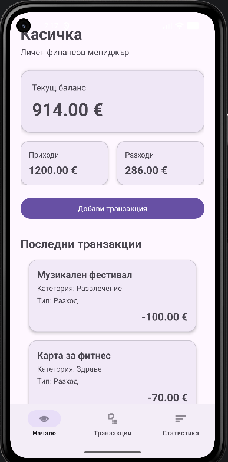
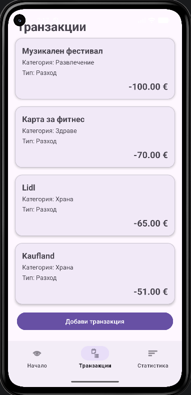
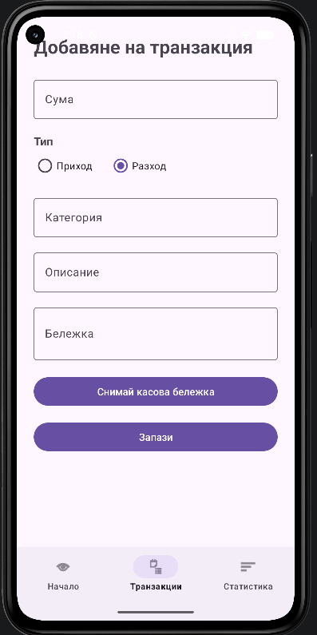
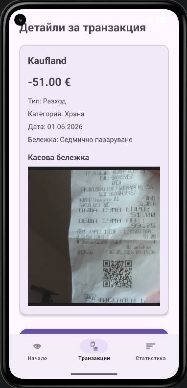
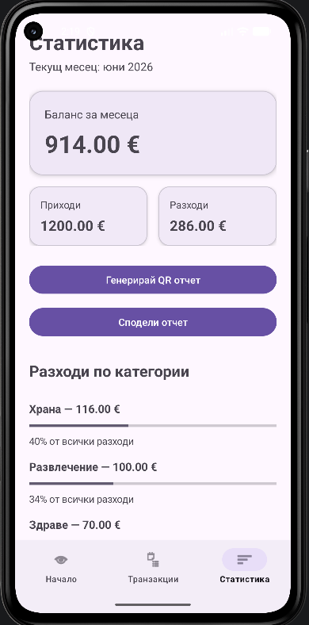

# Касичка

**Касичка** е Android мобилно приложение за управление на лични финанси. Проектът е разработен като учебен проект по програмиране на мобилни приложения и покрива изискванията за локална база данни, пълен CRUD, MVVM архитектура с Repository слой, Unit тестове, UI тест и допълнителни функционалности.

---

## Идея на приложението

Идеята на приложението е потребителят лесно да управлява своите приходи и разходи от мобилно устройство. Чрез приложението могат да се добавят финансови транзакции, да се следи текущ баланс, да се преглеждат всички записи, да се редактират или изтриват транзакции и да се анализират разходи по категории.

Приложението е подходящо за личен месечен бюджет, защото показва приходи, разходи, баланс, последни транзакции и месечна статистика. Допълнително потребителят може да снима касова бележка към транзакция, да генерира QR отчет и да сподели финансов отчет чрез Android Share менюто.

---

## Как работи

Потребителят добавя транзакция чрез форма, в която въвежда сума, тип, категория, описание и бележка. При нужда може да прикачи снимка на касова бележка чрез Camera Intent. Данните се записват локално в SQLite база данни и остават налични след рестарт на приложението. Всички записи се показват в списък, от който потребителят може да отвори детайли, да редактира или изтрие избрана транзакция. Началният екран изчислява и показва общ баланс, приходи, разходи и последни транзакции. Екранът „Статистика“ филтрира данните за текущия месец, групира разходите по категории и показва месечен отчет. Отчетът може да бъде генериран като QR код или споделен като текст чрез Share Intent.

---

## Архитектура

Проектът използва **MVVM архитектура** с **Repository слой**.

Основен поток на данните:

```text
Fragment → ViewModel → Repository → LocalDataSource → SQLite Database
```

Основни компоненти:

* `TransactionEntity` — модел на една финансова транзакция
* `KasichkaDatabaseHelper` — SQLiteOpenHelper клас за създаване и управление на базата данни
* `TransactionLocalDataSource` — клас за CRUD операции с SQLite
* `TransactionRepository` — Repository слой между ViewModel и локалния източник на данни
* `TransactionViewModel` — управлява данните за UI слоя чрез LiveData
* `Fragment` екрани — визуалната част на приложението

Примерна структура:

```kotlin
class TransactionRepository(
    private val localDataSource: TransactionLocalDataSource
) {
    fun getAllTransactions() = localDataSource.getAllTransactions()
    fun insertTransaction(transaction: TransactionEntity) =
        localDataSource.insertTransaction(transaction)
}
```

---

## Потребителски поток

1. Потребителят отваря приложението.
2. На началния екран вижда баланс, приходи, разходи и последни транзакции.
3. Потребителят добавя нова транзакция.
4. При нужда снима касова бележка към транзакцията.
5. Всички транзакции се показват в екрана „Транзакции“.
6. Потребителят отваря детайли за избрана транзакция.
7. От детайлния екран може да редактира или изтрие транзакцията.
8. В екрана „Статистика“ вижда месечен отчет и разходи по категории.
9. Потребителят може да генерира QR отчет.
10. Потребителят може да сподели месечния отчет чрез Share Intent.

---

## Основни функционалности

* Добавяне на приход или разход
* Преглед на всички транзакции
* Детайлен екран за транзакция
* Редактиране на транзакция
* Изтриване на транзакция
* Запазване на данните след рестарт
* Dashboard с баланс, приходи и разходи
* Последни 5 транзакции на началния екран
* Статистика по категории
* QR генериране на месечен отчет
* Share Intent за споделяне на отчет
* Camera Intent за снимане на касова бележка
* Прикачване на снимка към транзакция
* Unit тестове
* Espresso UI тест

---

## Технологии и версии

| Технология           | Използване                                   |
| -------------------- | -------------------------------------------- |
| Kotlin               | Основен език за разработка                   |
| Min SDK 24           | Минимална поддържана Android версия          |
| Target SDK 36        | Целева Android SDK версия                    |
| XML Layouts          | Изграждане на потребителски интерфейс        |
| Material Components  | Модерен UI дизайн                            |
| Navigation Component | Навигация между Fragment екрани              |
| SQLite               | Локално съхранение на данни                  |
| MVVM                 | Архитектура на приложението                  |
| Repository Pattern   | Разделяне на бизнес логика и достъп до данни |
| LiveData             | Наблюдение и обновяване на UI данни          |
| RecyclerView         | Списък с транзакции                          |
| ZXing Core           | Генериране на QR код                         |
| Camera Intent        | Снимане на касова бележка                    |
| FileProvider         | Безопасно споделяне на URI към снимка        |
| Share Intent         | Споделяне на месечен отчет                   |
| JUnit                | Unit тестове                                 |
| Espresso             | UI тестове                                   |

---

## Стъпки за стартиране

1. Клониране на repository:

```bash
git clone https://github.com/stu2301681077-GSI/MobileApps2025-2301681077.git
```

2. Отваряне на проекта в **Android Studio**.

3. Изчакване на Gradle Sync.

4. Стартиране на приложението на емулатор или физическо устройство чрез бутона **Run**.

5. За Unit тестове:

```bash
.\gradlew :app:testDebugUnitTest
```

6. За Espresso UI тестове е нужен стартиран емулатор или свързано устройство:

```bash
.\gradlew :app:connectedDebugAndroidTest
```

7. За тестване на Camera Intent е препоръчително използване на физическо устройство.

---

## Тестови акаунти

Приложението не използва потребителски акаунти, регистрация или вход. Всички данни се съхраняват локално на устройството чрез SQLite база данни.

---

## Скрийншотове

Скрийншотовете са разположени в папка:

```text
/docs/images
```

### Начален екран



### Списък с транзакции



### Добавяне на транзакция



### Детайли за транзакция



### Статистика



### QR отчет


---

## APK

Release APK файлът е добавен в repository-то на следния път:

[`/apk/app-release.apk`](apk/app-release.apk)

Файлът може да бъде изтеглен и инсталиран на Android устройство.

---

## Тестове

Проектът съдържа Unit тестове и Espresso UI тест.

Unit тестовете проверяват:

* изчисляване на приходи
* изчисляване на разходи
* изчисляване на баланс
* групиране на разходи по категории
* валидиране на сума и задължителни текстови полета

UI тестът проверява основен потребителски сценарий:

* стартиране на приложението
* добавяне на транзакция
* попълване на форма
* записване
* проверка дали транзакцията се появява в списъка

Команди за стартиране:

```bash
.\gradlew :app:testDebugUnitTest
.\gradlew :app:connectedDebugAndroidTest
```

---

## GitHub Repository

Repository-то е публично и е създадено според изискването:

```text
MobileApps2025-2301681077
```
